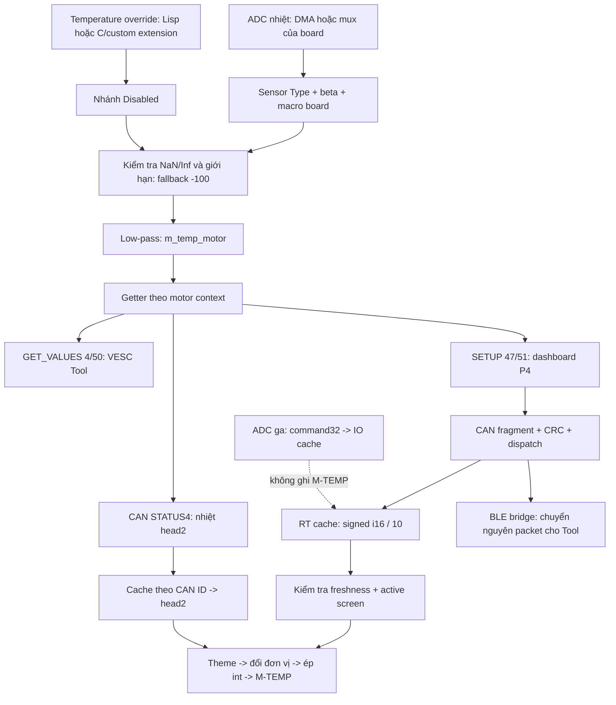

# M-TEMP: truy từng tầng, tái hiện và điều kiện kết luận

Ngày 2026-09-28. Tiếp nối [phân tích video](./M_TEMP_VIDEO_AND_REGRESSION_2026-09-27.md).
**Trạng thái sau phân tích:** người dùng đã yêu cầu sửa và build RC2. Các số
FAIL/điểm yếu ở mục5 là bằng chứng trước sửa; kết quả sau sửa nằm trong
[gói RC2](../release/jc4880-v1.3.8-rc2-2026-09-28/TEST_CASES.md). Bảng dòng P4
bên dưới ghi vị trí lúc audit trước RC2; source hiện tại đã dịch dòng do fix.
Điều kiện người dùng đã xác nhận: nạp Lisp mới lên ESC kích hoạt lỗi, motor
không có cảm biến nhiệt, VESC Tool cũng đổi nhiệt theo ga. Người dùng bổ sung:
**firmware VESC 6.05, ga dùng cấu hình mặc định**. Chưa có model ESC, định danh
build/custom, Sensor Type thực tế, chân núm hoặc kiểu kết nối Tool.

**Đã tái hiện được cơ chế tạo các số trong video bằng mã chuyển đổi VESC và
formatter P4 thật. Chưa xác định được nguyên nhân trên đúng ESC của người dùng.**
Phải phân biệt việc có thể tạo cùng số với chứng minh vì sao điện áp/packet đó
xuất hiện trên thiết bị. Không thay giả thuyết bằng kết luận chỉ để báo đã tìm ra.

## 0. Cập nhật theo firmware 6.05 đã xác nhận

Đã chạy lại bộ chuyển đổi với official 6.05 commit
`a0d40e2c5a42c810888d8c379307e6b0a118a125`: **603 checks, 0 failures**;
[log 6.05](./diagnostics/mtemp-2026-09-28/conversion-6.05.txt).
Sáu file đầu vào được đối chiếu Git blob của commit và ghim SHA256 trong
[runner](../scripts/test_mtemp_conversion.py). Test7.00 sau thay đổi runner
cũng đạt603/603. Vẫn dùng macro board VESC6 minh họa; firmware6.05 không xác
định model phần cứng, chân ADC hoặc cấu hình đang lưu trên ESC.

| Đường nhiệt 6.05 | Dòng nguồn |
|---|---|
| Getter filtered theo motor | [mc_interface.c](../research/_sources/vesc-official-audit/bldc-6.05/motor/mc_interface.c),1532 |
| Switch loại cảm biến, NTC/ADC | Cùng file,2233 |
| Disabled lấy override | Cùng file,2280 |
| Invalid chuyển−100; low-pass | Cùng file,2289/2293 |
| Enum NTC10k=0, Disabled=8 | [datatypes.h](../research/_sources/vesc-official-audit/bldc-6.05/datatypes.h),101/109 |

Kết quả số giống7.00: đổi ADC nhiệt mới tạo−99/2/1/−17 trong fixture; đổi
riêng ADC ga không đổi nhiệt. Đây vẫn chưa là bằng chứng ga tác động vào
đầu vào nhiệt trên ESC thực. Các bảng7.00 phía dưới được giữ như tham chiếu,
không gán số dòng hoặc mọi binding7.00 sang6.05.

**“Ga dùng cấu hình mặc định” chưa xác định cấu hình nhiệt hoặc ADC đang lưu.**
Trong source6.05 chung, [mcconf_default.h](../research/_sources/vesc-official-audit/bldc-6.05/motor/mcconf_default.h),
569/575 đặt beta3380 và Sensor Type **NTC10k**, không phải Disabled. Đây là
default `#ifndef`, board/custom có thể override và cấu hình đã lưu có thể khác.
Do đó không lắp cảm biến vẫn có thể đi qua công thức NTC nếu giữ default này.
Nó giải thích khả năng xuất hiện−99, chưa giải thích vì sao nhiệt đổi theo ga.

[appconf_default.h](../research/_sources/vesc-official-audit/bldc-6.05/applications/appconf_default.h),
81/146 đặt appUART và ADC Control TypeNONE. Không suy lời mô tả “ga mặc định”
là toàn bộ cấu hình này, hoặc tự suy thành Current. Cần đọc giá trị thực tế.
Nếu `adc-ctrl-type` khác0, [Lisp hiện tại](../lisp/main.lisp),119/122 gán
fault9 lúc nạp; motor loop874 gọi `ride-input-fault` tại151, chuyển fault12 và
PARK; `ride-select-mode` tại605 yêu cầu fault0 nên không đổi mode. Nhánh này
đã có test trong [test_lisp_safety.py](../scripts/test_lisp_safety.py),204/330;
đây là nguyên nhân **có điều kiện** của mode refusal, không phải writer M-TEMP.
Không sửa/bỏ interlock hoặc tự đổi cấu hình ESC trong lượt kiểm tra này.

**Probe đúng6.05:** [extensions](../research/_sources/vesc-official-audit/bldc-6.05/lispBM/lispif_vesc_extensions.c),
905/944/1934/3825/3869 hỗ trợ `(get-adc 0)`, `(get-adc 3)`,
`(get-adc-decoded 0)`, `(get-temp-mot)`, `(conf-get 'm-motor-temp-sens-type)`,
`(conf-get 'm-ntc-motor-beta)`, `(conf-get 'adc-ctrl-type)`.
`get-adc3` đọc thermal slot motor1; **get-temp-mot-res không tồn tại trên6.05**.
Mô tả binding đó ở mục8 là finding của7.00, không phải phép đọc cho ESC này.

Restart6.05 cũng gọi loader trước script: [lispif.c](../research/_sources/vesc-official-audit/bldc-6.05/lispBM/lispif.c),687;
[extensions](../research/_sources/vesc-official-audit/bldc-6.05/lispBM/lispif_vesc_extensions.c),
5229/5245 dừng C libraries rồi đặt EXT/EXT2 analog, không reset override nhiệt.
Vì vậy A/B nạp lại chính Lisp cũ vẫn cần để tách tác dụng restart.

## 1. Luồng đầy đủ



Nhiệt được cập nhật định kỳ độc lập với việc motor đang kéo hay đang PARK.
Vì thế current=0 không ngăn một đầu vào nhiệt không hợp lệ tạo số thay đổi.
Nếu Tool nối trực tiếp ESC thì P4 không nằm trên đường số liệu của Tool.
Nếu Tool nối BLE qua P4, hai giao diện có thể cùng nhận một nguồn packet CAN.

## 2. Checklist nguồn ESC theo dòng

Tất cả dòng ESC dưới đây thuộc official VESC 7.00 commit
`20cbb362687291242ab90b99f25fbfe8835540fc`; **chưa phải firmware xác định trên ESC**.
478 file bổ sung được đối chiếu Git blob và lưu provenance trong cache ignored.
Ký hiệu: **SRC** đã đọc nguồn; **HOST** đã chạy đoạn nguồn tương ứng với fixture;
**HW?** cần đo/xác nhận trên thiết bị. Các mức này không thay thế nhau.

| Check | File / dòng | Đường chạy và ảnh hưởng | Mức |
|---|---|---|---|
| E01 | [mc_interface.c](../research/_sources/vesc-official-audit/bldc-7.00/motor/mc_interface.c), 169/183 | Xóa state về0, đọc cấu hình motor đã lưu; absence sensor không tự chọn Disabled | SRC, HW? |
| E02 | [mcpwm_foc.c](../research/_sources/vesc-official-audit/bldc-7.00/motor/mcpwm_foc.c), 414/467 | DMA cập nhật ADC_Value; sequence ADC do board quyết định | SRC, HW? |
| E03 | [hw_60_core.c](../research/_sources/vesc-official-audit/bldc-7.00/hwconf/trampa/vesc6/hw_60_core.c), 177 | Ví dụ VESC6: temp index9 ứng với ADC1 channel14; không suy đây là chân ESC người dùng | SRC |
| E04 | [mc_interface.c](../research/_sources/vesc-official-audit/bldc-7.00/motor/mc_interface.c), 2605/2744 | Timer gọi update_override_limits cho từng motor rồi sleep1ms; vẫn chạy khi ga/PARK khóa | SRC |
| E05 | Cùng file, 2271 | Switch Sensor Type: NTC10k/100k, PTC, KTY, NTCX/PTCX, PT1000 hoặc Disabled | SRC, HOST, HW? |
| E06 | [hw_60_core.h](../research/_sources/vesc-official-audit/bldc-7.00/hwconf/trampa/vesc6/hw_60_core.h), 224/225 | Macro ví dụ: R=10000/(4095/ADC−1), rồi chuyển R bằng beta | SRC, HOST |
| E07 | [mc_interface.c](../research/_sources/vesc-official-audit/bldc-7.00/motor/mc_interface.c), 2317 | Disabled lấy m_temp_override; bỏ qua công thức ADC nhiệt | SRC, HOST, HW? |
| E08 | Cùng file, 1805 | Setter override ghi nguồn nhiệt thay thế; cần truy custom extension nếu Disabled vẫn đổi | SRC, HW? |
| E09 | Cùng file, 2325 | NaN/Inf hoặc ngoài −200…600 → −100 | SRC, HOST |
| E10 | Cùng file, 2329; [hw.h](../research/_sources/vesc-official-audit/bldc-7.00/hwconf/hw.h), 653; [utils_math.h](../research/_sources/vesc-official-audit/bldc-7.00/util/utils_math.h), 100 | value -= coefficient×(value−sample); mặc định0.01, board có thể override | SRC, HOST |
| E11 | [mc_interface.c](../research/_sources/vesc-official-audit/bldc-7.00/motor/mc_interface.c), 1550 | Getter lấy filtered temperature theo motor được chọn | SRC |
| E12 | [commands.c](../research/_sources/vesc-official-audit/bldc-7.00/comm/commands.c), 401/819 | Tool GET_VALUES và P4 SETUP đều lấy cùng getter, serialize i16×10 | SRC, HOST phần serializer |
| E13 | [comm_can.c](../research/_sources/vesc-official-audit/bldc-7.00/comm/comm_can.c), 1248 | STATUS4 cũng dùng cùng getter; đây là nguồn cho head2 | SRC |
| E14 | [mc_interface.c](../research/_sources/vesc-official-audit/bldc-7.00/motor/mc_interface.c), 267/294/2547 | Motor selector thuộc từng thread; getter chọn state motor theo thread hoặc FOC ISR đang chạy | SRC |
| E15 | [comm_can.c](../research/_sources/vesc-official-audit/bldc-7.00/comm/comm_can.c), 1592/1755/1797/2263 | CAN chọn motor theo node đích, xử lý command rồi khôi phục context cũ | SRC |
| E16 | Cùng file, 1244/1498 | STATUS4 chọn motor và gửi với ID tương ứng; hai motor không dùng chung một ID nhiệt | SRC |
| E17 | [comm_usb.c](../research/_sources/vesc-official-audit/bldc-7.00/comm/comm_usb.c), 94/129; [commands.c](../research/_sources/vesc-official-audit/bldc-7.00/comm/commands.c), 733 | USB có thread riêng; forward nội bộ motor2 chọn2 rồi trả1. Không nhận selector của Lisp thread | SRC |

Root/release/canonical Lisp đều không gọi `select-motor`. Các API thêm vào
không đổi selector của CAN/USB trong nguồn official. Vì vậy chưa có cơ chế
để PARK hoặc `set-current` tự chuyển nguồn nhiệt Tool sang motor khác; chọn
nhầm node, firmware custom và callback tùy biến vẫn cần kiểm trên thiết bị.

Các dòng then chốt, trích nguyên văn từ nguồn tham chiếu:

```c
case TEMP_SENSOR_DISABLED:
    temp_motor = motor->m_temp_override;
    break;

if (UTILS_IS_NAN(temp_motor) || UTILS_IS_INF(temp_motor) || temp_motor > 600.0 || temp_motor < -200.0) {
    temp_motor = -100.0;
}
UTILS_LP_FAST(motor->m_temp_motor, temp_motor, MOTOR_TEMP_LPF);
```

## 3. Checklist trên P4 theo dòng

| Check | Source / dòng hiện tại | Đường chạy / kết quả kiểm tra |
|---|---|---|
| P01 | [vesc_rt_data.c](../components/vesc_can/vesc_rt_data.c), 90 | Request51 chứa bit1 nhiệt motor; mask mặc định không yêu cầu bit17 VESC_ID |
| P02 | [comm_can.c](../components/vesc_can/comm_can.c), 497/508/555 | Ghép fragment theo địa chỉ đích, rồi CRC; chưa kiểm đủ vùng nhận mới, callback thiếu sender |
| P03 | [main.c](../main/main.c), 188 | Fan-out cùng payload cho RT, IO, Lisp, config, bridge |
| P04 | [vesc_rt_data.c](../components/vesc_can/vesc_rt_data.c), 122/162 | Chỉ command47/51 được đọc vào nhiệt; motor i16/10. ADC32/custom36 bị bỏ qua |
| P05 | [vesc_io_data.c](../components/vesc_can/vesc_io_data.c), 72 | ADC32 vào s_io riêng; đã chứng minh ADC đổi thật mà M-TEMP không đổi |
| P06 | [vesc_rt_data.c](../components/vesc_can/vesc_rt_data.c), 65/224 | Các writer khác là init0 và inject toàn snapshot từ emulator |
| P07 | [vesc_ui_updater.c](../main/vesc_ui_updater.c), 108/143 | Freshness hợp lệ mới đưa rt->temp_motor vào update_temp_motor; stale thì giữ số cũ |
| P08 | Cùng file, 180/230 | Active screen/demo chặn pump; rời demo xóa0 một lượt rồi đẩy dữ liệu thật nếu fresh |
| P09 | [dashboard_theme.c](../Super_VESC_Display/custom/dashboard_theme.c), 216 | Dispatch trực tiếp sang callback temp_motor của theme |
| P10 | [custom.c](../Super_VESC_Display/custom/custom.c), 950/958/969 | Cockpit đổi đơn vị, ép int, ghi đúng label motor; không dùng ADC/gear/current |
| P11 | [settings_wrapper.c](../Super_VESC_Display/custom/settings_wrapper.c), 342 | Celsius giữ nguyên; Fahrenheit=C×9/5+32. Đổi km/mile không đổi nhiệt |
| P12 | [theme_generic.c](../Super_VESC_Display/custom/theme_generic.c), 325/356 | Theme khác cũng dùng motor value; head2 chỉ nối thêm sau dấu / |
| P13 | [vesc_head2.c](../components/dev_settings/vesc_head2.c), 22/33 | Lấy STATUS4 đúng ID, age≤1000ms; không ghi đè head1 |
| P14 | [ble_nus.c](../main/ble_nus.c), 176/200/445/469 | Tool đi/đến ESC bằng raw packet; bridge không lấy số từ widget hay RT cache |
| P15 | [realtime_viewer.c](../Super_VESC_Display/custom/realtime_viewer.c), 166/175 | Viewer một số lẻ nhiệt và các ADC riêng, hữu ích phân biệt formatter với raw RT |
| P16 | [custom.c](../Super_VESC_Display/custom/custom.c), 627/660 | Demo M-TEMP32…68°C; không tạo signature−99/1/2 trong video |
| P17 | [vesc_sim.c](../main/vesc_sim.c), 194/203/225 | Emulator nhiệt≥22°C, nguồn áp tổng hợp khác video; khởi động thay đường CAN |
| P18 | [vesc_tool_menu.c](../Super_VESC_Display/custom/vesc_tool_menu.c), 301; [vesc_config_runtime.c](../components/vesc_config/vesc_config_runtime.c), 395 | Write cấu hình motor chỉ qua yêu cầu ghi sau đọc/sửa; không thấy mode hoặc render tự đổi Sensor Type |

Giữa e7f0b16 và7c77f2b, các đường nhiệt/ADC/bridge/emulator/head2 trên không đổi;
thay đổi updater tập trung gear. RC1 thêm validation độ dài51, không đổi scale
hay formatter nhiệt. Generated label và callback theme cũng được kiểm: không
gán nhầm widget ADC/current sang M-TEMP.

## 4. Tái hiện số trong video bằng nguồn nguyên bản

[Runner conversion](../scripts/test_mtemp_conversion.py) lấy đoạn source được
ghim SHA256, compile cùng decoder production và formatter cockpit nguyên bản.
**603 checks PASS**, [log](./diagnostics/mtemp-2026-09-28/conversion.txt).
Board macro dùng làm ví dụ là VESC6, pull-up10k, beta3380, LPF0.01. Không phải
model được xác nhận của ESC; các điện áp sau là **input cố ý chọn cho fixture**.

| ADC nhiệt giả lập | Điện áp minh họa với Vref3.3V | Sau lọc | Wire i16/10 | Nhãn M-TEMP |
|---:|---:|---:|---:|---:|
| 4095 | 3.3000V | −99.9996185 | −99.9 | −99 |
| 2933 | 2.3636V | khoảng2.488 | 2.4 | 2 |
| 2969 | 2.3926V | khoảng1.510 | 1.5 | 1 |
| 3555 | 2.8648V | khoảng−17.498 | −17.4 | −17 |

Với đầu vào rail và bộ lọc khởi tạo0, công thức NTC ra giá trị không hợp lệ;
fallback−100, sai số/độ phân giải float làm trạng thái lọc dừng hơi trên−100;
serialize bỏ phần lẻ của giá trị×10, rồi P4 lại ép int. Đây là một đường cụ thể
tạo−99 mà không có nhiệt−99°C ngoài thực tế. Nếu filter bắt đầu **đúng−100** thì
wire/label vẫn−100: không được nói−100 luôn hiển thị−99.

Control tests quan trọng:

- Quét **EXT ga độc lập** và packetADC32, xác nhận decoder thực sự nhận level/
  voltage mới: M-TEMP không đổi.
- Muốn tái hiện2/1/−17 ở thí nghiệm này, phải đổi **chính ADC nhiệt**. Không tự
  suy ra EXT và TEMP_MOTOR dùng chung chân trên board người dùng.
- Sensor Type Disabled với override0: toàn bộ sweep ADC không đổi nhiệt.
  Đổi override37.5 thì nhãn37, dù ADC bất kỳ.
- Có kiểm midpoint10k≈25°C, invalid→valid không reset filter, các rail của
  tám loại sensor, nonfinite guard và đơn vị C/F/head2.
- Các ADC cho2/1/−17 được tìm bằng chính công thức để minh họa khả năng tái
  hiện; chúng **không phải phép đo hoặc ước lượng điện áp từ video**.

## 5. Tái hiện đường UI và đường CAN

[UI runner](../scripts/test_mtemp_ui.py) chạy bốn hàm updater nguyên văn cùng
RT/IO/head2 production: **5 control PASS và 2 điểm yếu được tái hiện**.
[Log UI](./diagnostics/mtemp-2026-09-28/ui.txt). ADC0…1, voltage1…3.1V,
current0…37.02A và gear1/2/3/P được đổi độc lập; M-TEMP giữ đúng giá trị đầu vào.
Freshness, off-screen, demo exit, head2 ID/age/tick wrap đều chạy qua asserts.

Hai case `observe_*` PASS nghĩa là **ghi nhận điểm yếu hiện có, chưa sửa**:
mask0/current-only làm mới tuổi nhiệt cũ; command47 cụt vẫn commit phần nhiệt
có trong prefix, thậm chí header-only làm mới timestamp. Không tự tạo nhiệt từ
ga; muốn liên hệ video cần đúng packet đã nhận ngoài thực tế.

[CAN runner](../scripts/test_mtemp_transport.py) compile cả comm_can.c,
RT/IO decoder, buffer và CRC thật. Bốn contract bị vi phạm, giữ exit1 thay vì
biến chúng thành test xanh. [Log hiện tại](./diagnostics/mtemp-2026-09-28/transport.txt).

| Case | Kết quả tái hiện | Có giải thích video chưa? |
|---|---|---|
| Gói47/51 hợp lệ; ADC32 + Lisp36 safety/status xen kẽ | Nhiệt đúng; ADC/custom không đổi nhiệt | Loại giả thuyết nhầm field đơn giản trong đường hợp lệ |
| Chồng fragment / thiếu đuôi khác giá trị cũ | CRC fail, không cập nhật nhiệt | Không phải cơ chế chuyển ADC thành nhiệt |
| Sai nguồn | Target10 vẫn nhận reply sender11:12.5→2°C | Chỉ phù hợp nếu có nguồn khác/route sai; chưa có topology thực |
| Thiếu fragment nhưng đuôi cũ giống đuôi cần nhận | CRC khớp, timestamp1000→5000 dù chưa nhận hết fragment mới | Lỗi coverage/freshness, chưa chứng minh nhiệt sai |
| GóiA9byte(12.5), B7byte(−17), rồi prefixA+CRC_A thiếu tailA | Ghép lại A từ tail giữ lại, giá trị−17→12.5 | **CRC_A vốn mô tả12.5**: không chứng minh số sai so với sender; cần layout/traffic này thực sự xảy ra |
| STATUS4 DLC2 | Đọc byte backing ngoài DLC và ghi−17 vào cache STATUS4; RT không đổi | Không giải thích riêng M-TEMP head1 của video |

Ma trận nguồn: **e7f0b16,7c77f2b và working tree đều5/9 PASS, cùng4 FAIL**.
Log baseline: [e7f0b16](./diagnostics/mtemp-2026-09-28/transport-e7f0b16.txt),
[7c77f2b](./diagnostics/mtemp-2026-09-28/transport-7c77f2b.txt).
Vì vậy đây là điểm yếu có từ trước release mới, không được coi là thay đổi mới
đã gây video. Official VESC có kiểm offset nhận bằng length tại
[comm_can.c](../research/_sources/vesc-official-audit/bldc-7.00/comm/comm_can.c),
1717; P4 chưa có bước coverage tương ứng. DLC thiếu ở control frames còn là
rủi ro source đã thấy; chưa tiêm case có thể gây memcpy length âm trong lượt này.

## 6. Vì sao phải tách “nạp Lisp” khỏi “nội dung Lisp”

So từng API có tác dụng phụ của [Lisp gốc](../main.lisp) và
[Lisp release gây lỗi](../release/jc4880-v1.3.7-2026-09-19-7c77f2b/main.lisp):

| API / thay đổi | Kết quả truy nguồn |
|---|---|
| app-disable-output1500→−1, thêm startup set-current0 | Thay cờ/timer output và lệnh motor; không remap ADC hoặc ghi sensor config |
| conf-get adc-ctrl-type, app-adc-range-ok | Chỉ đọc; không thay nguồn nhiệt |
| conf-set current scale/min-speed | Cùng họ khóa ở hai bản; không ghi Sensor Type/beta/override |
| GPIO TX/RX pull-up | Cùng pin/mode; đổi timing TX init. Scan334 header official chưa thấy UART pin chồng ADC/mux selector; không loại trừ board custom |
| PARK / supervisor / đổi packet safety/status | Khóa lực kéo và đổi dữ liệu36; không có trường nhiệt trong protocol Lisp này |
| Bỏ motor tone | Bớt kích winding, không giải thích nhảy≈100°C trong vài giây khi không có cảm biến |
| EEPROM | Khối riêng ride/beep, không phải cấu hình sensor motor |

**Phát hiện mới ở quá trình restart:**
[lispif.c](../research/_sources/vesc-official-audit/bldc-7.00/lispBM/lispif.c),788,
gọi loader; [lispif_vesc_extensions.c](../research/_sources/vesc-official-audit/bldc-7.00/lispBM/lispif_vesc_extensions.c),
6451 dừng C libraries đã nạp,6466/6471 đặt EXT/EXT2 về analog; sau đó chạy custom
load callbacks. Các việc này xảy ra trước script và áp dụng cho cả bản cũ lẫn
mới. Override nhiệt không tự reset ở đây. Vì thế cần thử **nạp lại cùng Lisp cũ**
để tách tác dụng restart/extension khỏi nội dung mới.

## 7. Board-specific: không được tự suy pinout

- A50S Dual có EXT và TEMP_MOTOR cùng index7, nhưng macroNTC10k trả hằng25 và
  mặc định Disabled; chỉ một số loại sensor khác mới đọc index alias. Xem
  [header](../research/_sources/vesc-official-audit/bldc-7.00/hwconf/teamtriforceuk/a50s_dual/hw_a50s_dual_core.h),51/89/195.
- Stormcore60D dùng mux vật lý chung cho nhiệt và ADC ga, đổi mux, chờ400µs,
  lọc median9 rồi ghi các slot khác nhau: [source](../research/_sources/vesc-official-audit/bldc-7.00/hwconf/stormcore/60D/hw_stormcore_60d_core.c),343/354.
  Đây là đường có thể cross-channel do phần cứng/timing, chưa quan sát ở ESC này.
- Board khác có macro nhiệt riêng, kết hợp nhiều sensor hoặc hằng25/−20;
  LunaM600 dùng LPF0.001. Không coi macro VESC6 là công thức chung mọi ESC.
- Lisp evaluator có priority thấp hơn timer/mux trong nguồn đã xem; chưa có
  bằng chứng thêm Lisp làm starve ADC. Không quy CPU load chỉ từ thời điểm nạp.

## 8. Phép đo tối thiểu để chốt đúng nhánh nguyên nhân

Hiện chỉ thấy hai cổng Bluetooth COM6/COM7 trên máy, không thấy USB ESC/P4 được
nhận diện. Chưa mở cổng, không flash/ghi cấu hình/điều khiển motor. Thông tin
board, Sensor Type và đường nối Tool đang được hỏi người dùng.

Trước tiên đọc cùng lúc trên **đúng ESC/motor**: Motor Temperature Sensor Type,
beta; raw/decoded ADC ga; raw đầu vào nhiệt; filtered MotorTemp; nguồn/CAN ID.
Với official firmware tương thích, các expression chỉ đọc có sẵn là
`(get-temp-mot)`, `(get-adc 0)`, `(get-adc 1)`, `(get-adc 3)`,
`(get-adc-decoded 0)`, `(get-adc-decoded 1)`, `(app-adc-range-ok)`.
Đối chiếu binding tại [extensions](../research/_sources/vesc-official-audit/bldc-7.00/lispBM/lispif_vesc_extensions.c),1184/1836/2289.
Không có script điều khiển mới được nạp để thực hiện lượt này.

Các binding official chỉ đọc bổ sung:
`(get-selected-motor)`, `(conf-get 'm-motor-temp-sens-type)`,
`(conf-get 'm-ntc-motor-beta)`. Getter tại
[extensions](../research/_sources/vesc-official-audit/bldc-7.00/lispBM/lispif_vesc_extensions.c),
948/4290/4527. Dùng `conf-get` không có tham số thứ hai để đọc cấu hình thực,
không đọc default/limits. Enum tại
[datatypes.h](../research/_sources/vesc-official-audit/bldc-7.00/datatypes.h),103:
NTC10k=0, PTC1k=1, KTY83=2, NTC100k=3, KTY84=4, NTCX=5, PTCX=6,
PT1000=7, **Disabled=8**; không diễn giải0 là Disabled. Phải đối chiếu lại
binding/enum nếu ESC dùng firmware custom hoặc phiên bản khác.

**Cảnh báo độ đúng của probe dual-motor:** `get-adc3` đọc kênh nhiệt motor1.
`get-temp-mot-res` upstream dùng ternary motor_now()?motor1:motor2 trong khi
motor_now trả1/2, nên cũng chọn motor1 ở cả hai trường hợp. Không dùng hai phép
đó để kết luận ADC motor2. `get-temp-mot` trả đúng filtered theo context.

| Quan sát thực cần có | Nhánh nguyên nhân xác nhận/loại |
|---|---|
| Tool trực tiếp và get-temp-mot cùng đổi, rawTEMP_MOTOR đổi theo ga, Sensor Type bật | Nguồn đầu vào nhiệt ESC: wiring/mapping/mux/coupling; đọc đúng board source để xác định cơ chế |
| Raw nhiệt đúng motor ổn định nhưng filtered đổi | Sensor config/override/custom macro/context; không quy cho ADC ga nếu chưa có writer |
| Disabled nhưng filtered đổi theo ga | Truy writer override hoặc chọn nhầm motor/node; NTC ADC không phải đường đang chạy |
| Tool trực tiếp ổn định, P4/Tool qua P4 đổi | Thu CAN/raw47/51 và sender, kiểm transport trước widget |
| Raw47/51 ổn định nhưng nhãn P4 đổi | Trace input callback/units/theme; test hiện tại chưa tái hiện sai đường này |

Ma trận A/B cần giữ P4, ESC, wiring/config và nguồn đọc cố định:

1. Lisp gốc đang chạy → ghi bộ số trên.
2. Nạp lại **chính Lisp gốc**, ghi lại: nếu đổi ở đây thì restart/state là tác nhân,
   không đủ căn cứ đổ cho nội dung Lisp mới.
3. Nạp bản mới nguyên gói1.3.7, cùng thao tác núm: xác định chênh lệch thực.
4. So Lisp-only restart với cold ESC restart để kiểm trạng thái override/extension.

Lisp gốc khởi động throttle-on1 và không có PARK; chỉ làm A/B trên bàn thử đã
ngăn lực kéo ngoài ý muốn. Không coi trạng thái PARK cũ trên P4 là khóa motor
sau khi nạp lại script. Không đổi Sensor Type sang Disabled để làm số biến mất
rồi kết luận đã chữa nguyên nhân.

## 9. Trạng thái bàn giao

Đã có checklist dòng nguồn, ba runner tái hiện, control tests và điều kiện loại
trừ. Source chạy/firmware và góiRC1 được giữ nguyên trong lượt phân tích này;
không tự che nhiệt hoặc áp dụng một fix chưa gắn với điều kiện video.

Điểm chưa có bằng chứng là **vì sao đầu vào/nguồn nhiệt thay đổi trên ESC cụ thể
sau khi nạp Lisp mới**. Chỉ source và video không phân biệt được những nhánh
phần cứng/custom/route nêu trên; cần bộ đo ở mục8 để kết luận có thể kiểm chứng.
